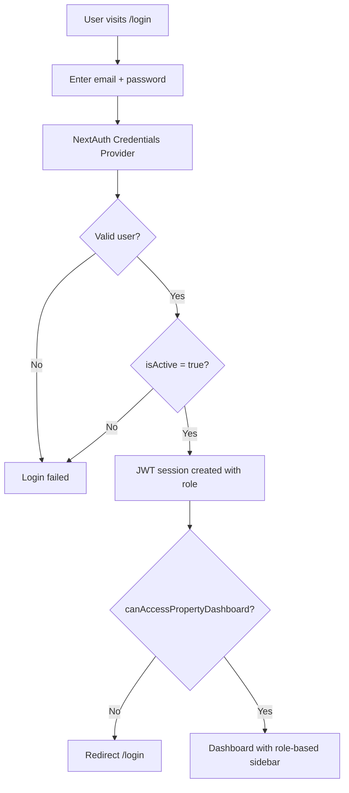
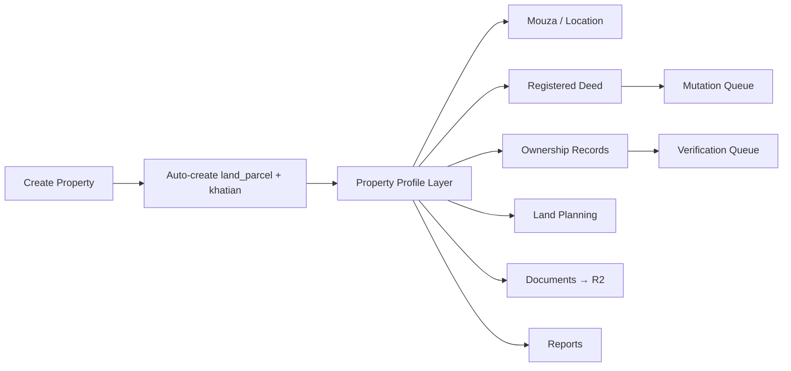
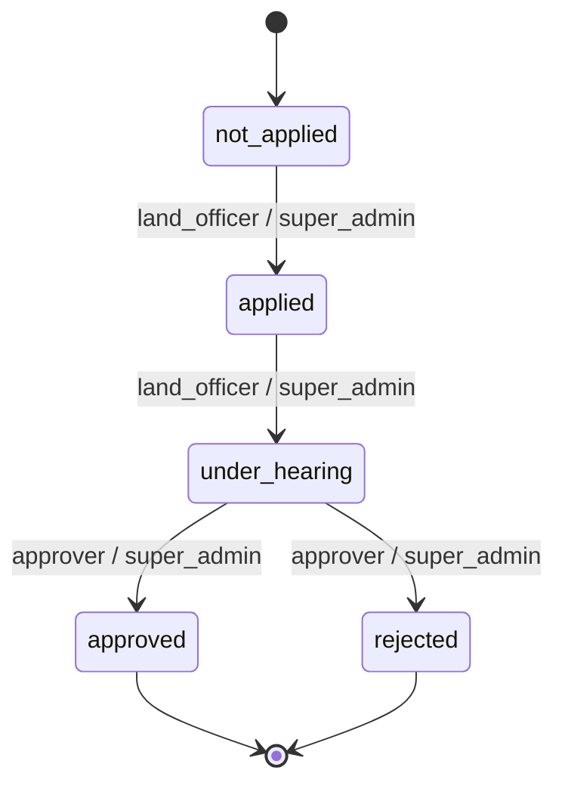
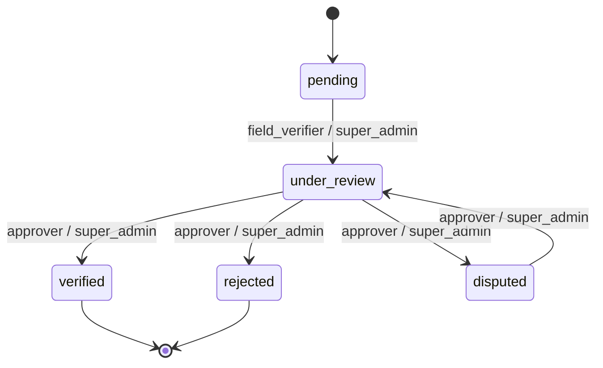
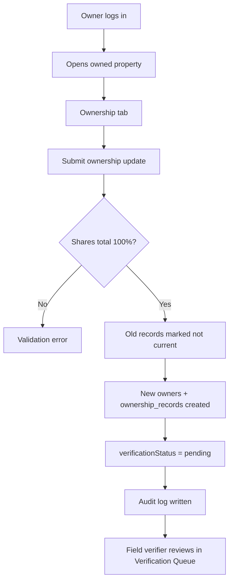
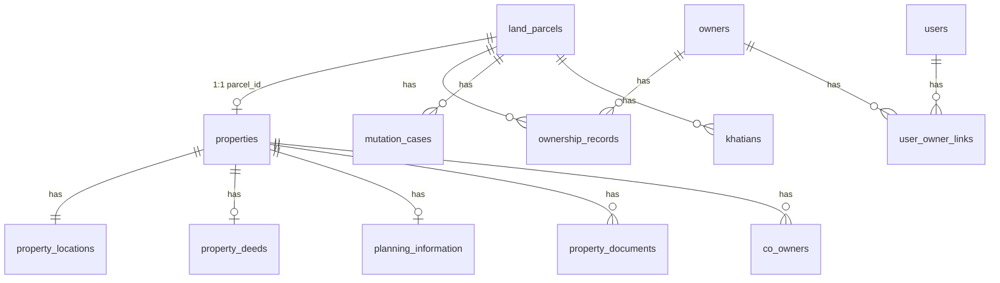

# Land Management System — Complete Guide

## 1. System Overview

The **Land Management System** is a Bangladesh land records platform for managing parcels, properties, ownership, deeds, mutations, and verification workflows. It serves three main audiences:

| Audience | Who they are | Primary access |
|----------|--------------|----------------|
| **Admin / Staff** | Government land officers, verifiers, approvers, legal staff | Full dashboard (`/dashboard/*`) |
| **Property Owners** | Registered landowners with portal accounts | Owner portal (`/dashboard/owner`) |
| **General Users / Public** | Citizens, bank viewers | Public search (`/search`, `/parcel/[id]`) |

The system has **two parallel data layers**:

1. **Legacy Parcels** — core spatial registry (`land_parcels`, khatians, mutations, verification)
2. **Properties** — newer profile layer linked 1:1 to parcels (`properties` → `land_parcels`)

---

## 2. Technology Stack

| Layer | Technology |
|-------|------------|
| Framework | Next.js 16 (App Router) |
| Database | PostgreSQL 16 + PostGIS |
| ORM | Drizzle ORM |
| Auth | NextAuth (Credentials + JWT) |
| Public files | Cloudinary (maps, photos) |
| Sensitive files | Cloudflare R2 (signed URLs) |
| Email | Resend (mutation notifications) |
| Encryption | NID numbers encrypted at rest |

---

## 3. User Types & Roles

### 3.1 Role Hierarchy

Roles are ranked in `lib/auth/rbac.ts`:

| Role | Hierarchy | Category |
|------|-----------|----------|
| `super_admin` | 100 | Admin |
| `land_officer` | 80 | Admin |
| `approver` | 75 | Admin |
| `field_verifier` | 70 | Admin |
| `legal_officer` | 65 | Admin |
| `bank_viewer` | 40 | General User |
| `property_owner` | 30 | Owner |
| `public_user` | 10 | General User (public only) |

### 3.2 Grouped Personas

The app groups roles into three personas (from `docs/PROPERTY_MANAGEMENT.md`):

| Persona | Roles | Dashboard access |
|---------|-------|------------------|
| **Admin** | `super_admin`, `land_officer`, `legal_officer`, `approver`, `field_verifier` | Yes — full admin sidebar |
| **Property Owner** | `property_owner` | Yes — owner portal sidebar |
| **General User** | `public_user`, `bank_viewer` | `bank_viewer` only; `public_user` is public-only |

---

## 4. Authentication Workflow



**Key rules:**
- Login page: `/login` (labeled "Staff sign in")
- Middleware protects `/dashboard/:path*` — unauthenticated users redirect to `/login`
- Dashboard layout additionally checks `canAccessPropertyDashboard(role)` — requires `bank_viewer` level or `property_owner`
- `public_user` **cannot** access the dashboard

### Demo Accounts (after `pnpm db:seed`)

| Email | Password | Role |
|-------|----------|------|
| admin@land.gov.bd | admin123 | super_admin |
| officer@land.gov.bd | admin123 | land_officer |
| approver@land.gov.bd | admin123 | approver |
| verifier@land.gov.bd | admin123 | field_verifier |
| owner@land.gov.bd | admin123 | property_owner |

---

## 5. Admin Workflow

### 5.1 Admin Sidebar Navigation

Admins see the full **Admin Panel** sidebar:

| Page | Path | Purpose |
|------|------|---------|
| Dashboard | `/dashboard` | Stats: properties, owners, deeds, documents, audit logs |
| Properties | `/dashboard/properties` | CRUD, filters, search |
| Owners | `/dashboard/owners` | Owner registry (name, phone, email, type) |
| Registered Deeds | `/dashboard/deeds` | Deed records |
| Mouza | `/dashboard/mouza` | Mouza management |
| Khatian | `/dashboard/khatian` | Khatian records |
| Plots | `/dashboard/plots` | Plot listings |
| Documents | `/dashboard/documents` | Document management |
| Reports | `/dashboard/reports` | Report generation |
| Land Planning | `/dashboard/land-planning` | Zoning, land use |
| Users | `/dashboard/users` | System users & roles |
| Audit Logs | `/dashboard/audit-logs` | Change history |
| Settings | `/dashboard/settings` | System config |
| Parcels (Legacy) | `/dashboard/parcels` | Original parcel workflow |
| Mutation Queue | `/dashboard/mutations` | Mutation maker-checker |
| Verification Queue | `/dashboard/verification` | Ownership verification |

### 5.2 Admin Permissions Matrix

| Action | super_admin | land_officer | legal_officer | approver | field_verifier | bank_viewer |
|--------|:-----------:|:------------:|:-------------:|:--------:|:--------------:|:-----------:|
| Create/edit properties | ✅ | ✅ | ✅ | ❌ | ❌ | ❌ |
| Delete/restore properties | ✅ | ✅ | ❌ | ❌ | ❌ | ❌ |
| Upload documents | ✅ | ✅ | ✅ | ❌ | ❌ | ❌ |
| Update deeds | ✅ | ✅ | ✅ | ❌ | ❌ | ❌ |
| Update ownership | ✅ | ✅ | ❌ | ❌ | ❌ | ❌ |
| View land planning | ✅ | ✅ | ✅ | ❌ | ❌ | ❌ |
| Manage mouza | ✅ | ✅ | ❌ | ❌ | ❌ | ❌ |
| Bulk operations | ✅ | ✅ | ❌ | ❌ | ❌ | ❌ |
| Apply mutations | ✅ | ✅ | ❌ | ❌ | ❌ | ❌ |
| Approve mutations | ✅ | ❌ | ❌ | ✅ | ❌ | ❌ |
| Verify ownership (start review) | ✅ | ❌ | ❌ | ❌ | ✅ | ❌ |
| Approve ownership verification | ✅ | ❌ | ❌ | ✅ | ❌ | ❌ |
| Download confidential docs | ✅ | ✅ | ✅ | ✅ | ✅ | ❌ |
| View mortgages | ✅ | ✅ | ✅ | ❌ | ❌ | ✅ |
| View property details | ✅ | ✅ | ✅ | ✅ | ✅ | ✅ |

### 5.3 Property Management Workflow (Admin)



**Property detail tabs (admin):**
- Profile
- Mouza
- Registered Deed
- Ownership
- Land Planning
- Documents
- Reports

**Creating a property:**
1. Admin goes to `/dashboard/properties/new`
2. Fills location (mouza, plot, area, khatians), optional deed info
3. System generates `propertyCode`, QR payload, syncs `land_parcels`
4. Audit log records the creation

**Editing sections:** Admins (`isPropertyAdmin`) can edit all property sections.

### 5.4 Mutation Workflow (Maker-Checker)

Handled via `/dashboard/mutations` and `POST /api/mutations/transition`.



| Transition | Who can do it |
|------------|---------------|
| `not_applied` → `applied` | land_officer, super_admin |
| `applied` → `under_hearing` | land_officer, super_admin |
| `under_hearing` → `approved` / `rejected` | approver, super_admin |

On approval/rejection, an email is sent via Resend (if configured).

### 5.5 Ownership Verification Workflow

Handled via `/dashboard/verification` and `POST /api/verification/transition`.



When status is `disputed`, ownership is **frozen** (`isOwnershipFrozen`).

### 5.6 Legacy Parcel Workflow (Admin)

Parcels use a separate tabbed UI at `/dashboard/parcels/[id]`:

| Tab | Path suffix | Content |
|-----|-------------|---------|
| Overview | `/` | Parcel summary |
| Ownership | `/ownership` | Owner records |
| Legal | `/legal` | Mutations, deeds, court cases |
| Land Use | `/land-use` | Land use data |
| Documents | `/documents` | Parcel documents |
| Services | `/services` | Related services |

---

## 6. Property Owner Workflow

### 6.1 Owner vs Owner Registry

There are **two related concepts**:

| Concept | Table | Description |
|---------|-------|-------------|
| **Owner registry** | `owners` | Land record entity (name, NID, phone, etc.) |
| **Owner portal user** | `users` with role `property_owner` | Login account linked via `user_owner_links` |

**Linking flow:**
```
user (property_owner) ←→ user_owner_links ←→ owners ←→ ownership_records ←→ land_parcels ←→ properties
```

`getOwnerPropertyIds(userId)` resolves which properties an owner user can access.

### 6.2 Owner Portal Navigation

Owners see a reduced **Owner Portal** sidebar:

| Page | Path |
|------|------|
| My Dashboard | `/dashboard/owner` |
| My Properties | `/dashboard/properties` (filtered to owned only) |

### 6.3 Owner Dashboard (`/dashboard/owner`)

1. Loads session user
2. Resolves owned property IDs via `user_owner_links` → `ownership_records` → `properties`
3. Shows count and list of linked properties
4. Each property links to `/dashboard/properties/[id]`

### 6.4 Owner Property Tabs

Owners see a **subset** of property tabs:

| Tab | Access |
|-----|--------|
| Profile | Read-only |
| Deed Info | Read-only |
| **Ownership** | **Can edit** (owned properties only) |
| Documents | Read-only |
| Reports | Read-only |

**Owner cannot access:** Mouza, Land Planning

### 6.5 Owner Ownership Update Workflow



**Validation rules:**
- NID: 10, 13, or 17 digits
- Phone: Bangladesh mobile format
- Ownership shares must total **100%**
- NID encrypted before storage

---

## 7. General User / Public Workflow

### 7.1 Public User (`public_user`)

- **No dashboard access**
- Can use public pages only

### 7.2 Bank Viewer (`bank_viewer`)

- Dashboard access (admin sidebar shown, but limited API permissions)
- Can view property details and download reports
- Can view mortgages
- Cannot edit, create, or download confidential documents

### 7.3 Public Pages (No Login Required)

| Page | Path | Description |
|------|------|-------------|
| Home | `/` | Landing page with links to search, dashboard, login |
| Parcel Search | `/search` | Search by division → district → upazila → union → mouza, JL, khatian, plot |
| Public Parcel View | `/parcel/[id]` | Read-only parcel summary |

**Public parcel view shows:**
- Plot number, mouza, district, area, JL number
- Khatian list
- Current owners (name + share % only)

**Public view does NOT show:**
- NID numbers
- Sensitive documents
- Confidential deed copies

---

## 8. Website Structure Map

```
/                           → Home (public)
/search                     → Parcel search (public)
/parcel/[id]                → Public parcel detail (public)
/login                      → Staff/owner sign in

/dashboard                  → Admin stats OR redirect if unauthorized
/dashboard/owner            → Owner dashboard
/dashboard/properties       → Property list (filtered by role)
/dashboard/properties/new   → Create property (admin only)
/dashboard/properties/[id]  → Property detail + tabs
/dashboard/owners           → Owner registry (admin)
/dashboard/deeds            → Deeds (admin)
/dashboard/mouza            → Mouza (admin)
/dashboard/khatian          → Khatian (admin)
/dashboard/plots            → Plots (admin)
/dashboard/documents        → Documents (admin)
/dashboard/reports          → Reports (admin)
/dashboard/land-planning    → Land planning (admin)
/dashboard/users            → User management (admin)
/dashboard/audit-logs       → Audit trail (admin)
/dashboard/settings         → Settings (admin)
/dashboard/parcels          → Legacy parcels (admin)
/dashboard/parcels/[id]/*   → Parcel tabs (admin)
/dashboard/mutations        → Mutation queue (admin)
/dashboard/verification     → Verification queue (admin)
```

---

## 9. Data Architecture



**Geography hierarchy:** Division → District → Upazila → Union → Mouza → Plot

**Property statuses:** `active`, `pending`, `disputed`, `archived`

---

## 10. API Endpoints

### Properties

| Method | Endpoint | Who | Purpose |
|--------|----------|-----|---------|
| GET | `/api/properties` | Authenticated | List (owners see only theirs) |
| POST | `/api/properties` | Admin | Create property |
| GET/PUT/DELETE | `/api/properties/[id]` | Role-based | CRUD |
| POST | `/api/properties/[id]/restore` | Admin | Restore soft-deleted |
| GET/PUT | `/api/properties/[id]/deed` | Admin / read for owner | Deed + versions |
| GET/PUT | `/api/properties/[id]/ownership` | Admin + owner (edit) | Ownership |
| GET/PUT | `/api/properties/[id]/planning` | Admin only | Land planning |
| GET/POST | `/api/properties/[id]/documents` | Admin upload / all view | Documents |
| POST | `/api/properties/bulk` | Admin | Bulk delete/restore/export |
| GET | `/api/properties/lookup` | Authenticated | Property lookup |

### Legacy Parcels

| Method | Endpoint | Purpose |
|--------|----------|---------|
| GET | `/api/parcels` | Search parcels |
| GET | `/api/parcels/[id]` | Full parcel detail |

### Workflows

| Method | Endpoint | Purpose |
|--------|----------|---------|
| POST | `/api/mutations/transition` | Advance mutation case |
| POST | `/api/verification/transition` | Advance ownership verification |

### Other

| Method | Endpoint | Purpose |
|--------|----------|---------|
| GET | `/api/geography` | Cascading location picker |
| POST | `/api/documents/sign-url` | Signed download URL (R2/Cloudinary) |
| POST | `/api/reports/generate` | Enqueue property report |
| GET | `/api/audit-logs` | Audit trail |
| GET | `/api/owners` | Owner registry |
| POST | `/api/auth/[...nextauth]` | NextAuth handlers |

---

## 11. Document & Storage Workflow

### Two-Tier Storage

| Provider | Document Types | Sensitivity |
|----------|----------------|-------------|
| **Cloudinary** | mouza_map, plot_map, gis_map, property_photo | public / restricted |
| **R2** | khatian_copy, deed_copy, mutation_certificate, court_document, survey_record, generated_report | confidential / restricted |

### Download Flow

1. User requests `POST /api/documents/sign-url` with `documentId`
2. System checks role against `canDownloadConfidential`
3. R2 docs get signed URL (10 min TTL; reports 15 min)
4. Download logged in `download_logs` + `audit_logs`

**Upload limits:** PDF, JPG, PNG, TIFF — max 20 MB

---

## 12. Audit & Security

Every write to ownership, legal, mutation, and property tables is logged:

| Field | Description |
|-------|-------------|
| `actorUserId` | Who made the change |
| `action` | create, update, delete, verify, download, transition |
| `entityTable` / `entityId` | What changed |
| `previousValue` / `newValue` | Before/after diff |
| `ipAddress` | Client IP |
| `createdAt` | Timestamp |

**Security features:**
- JWT sessions (no server-side session store)
- NID encryption at rest
- Maker-checker for mutations and verification
- Signed URLs for confidential files (no permanent public links)
- Role checks on every API route
- Ownership frozen when status is `disputed`
- Inactive users (`isActive !== "true"`) cannot log in

---

## 13. End-to-End Scenario Examples

### Scenario A: Admin registers new land

1. `land_officer` logs in → `/dashboard/properties/new`
2. Enters mouza, plot, area, deed details
3. System creates `land_parcel` + `property` + location + deed
4. Officer uploads khatian copy → R2
5. Officer applies mutation → Mutation Queue
6. `approver` approves mutation → email sent to applicant
7. `field_verifier` starts ownership review
8. `approver` marks ownership `verified`

### Scenario B: Owner updates co-owners

1. `owner@land.gov.bd` logs in → `/dashboard/owner`
2. Opens linked property → Ownership tab
3. Updates owner shares (must total 100%)
4. New `ownership_records` created with `verificationStatus: pending`
5. Staff reviews in Verification Queue
6. Approver finalizes as `verified` or `rejected`

### Scenario C: Citizen searches land

1. Visits `/search` (no login)
2. Filters by geography + plot number
3. Opens `/parcel/[id]` — sees plot info and owner names (no NID/docs)
4. Cannot access dashboard or confidential documents

---

## 14. Settings & Configuration

Current settings page (`/dashboard/settings`) documents:

- Max upload: **20 MB**
- Storage: **Cloudflare R2**
- Formats: PDF, JPG, PNG, TIFF
- Ownership validation: shares must total **100%**

Required environment variables: `DATABASE_URL`, `NEXTAUTH_SECRET`, `ENCRYPTION_KEY`, plus optional Cloudinary, R2, and Resend keys.

---

## 15. Key Source Files

| Area | File |
|------|------|
| Roles & permissions | `lib/auth/rbac.ts`, `lib/auth/property-permissions.ts` |
| Auth config | `lib/auth/options.ts` |
| State machines | `lib/workflows/state-machines.ts` |
| Property queries | `lib/properties/queries.ts` |
| Validations | `lib/properties/validations.ts` |
| Sidebar (role UI) | `components/layout/dashboard-sidebar.tsx` |
| Property tabs | `components/properties/property-tabs.tsx` |
| DB schema | `lib/db/schema/` |
| Seed data | `lib/db/seed.ts` |
| Documentation | `docs/PROPERTY_MANAGEMENT.md`, `README.md` |

---

This document reflects the current codebase. If you want this saved as a file in the repo (e.g. `docs/SYSTEM_GUIDE.md`), switch to **Agent mode** and I can create it for you.